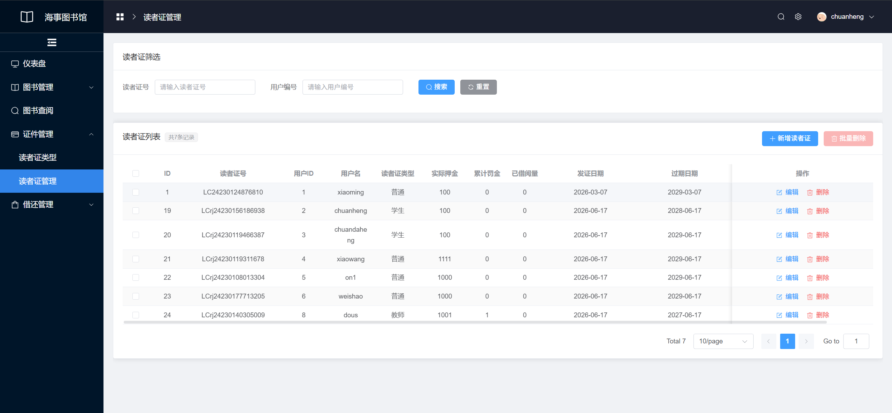
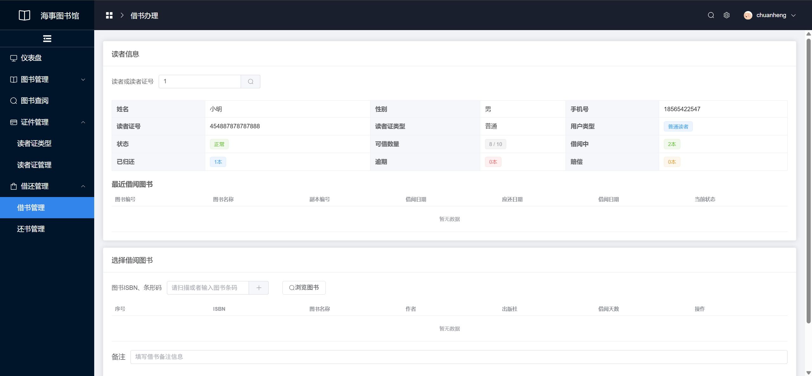
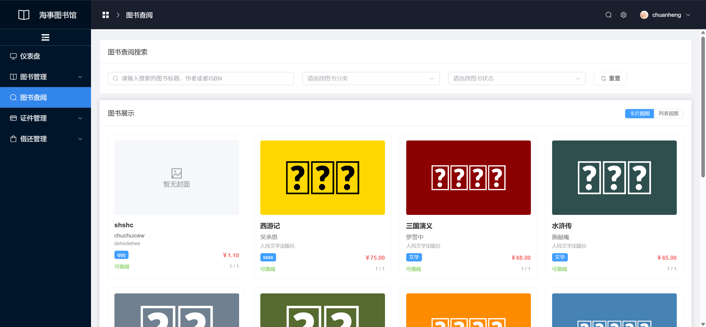
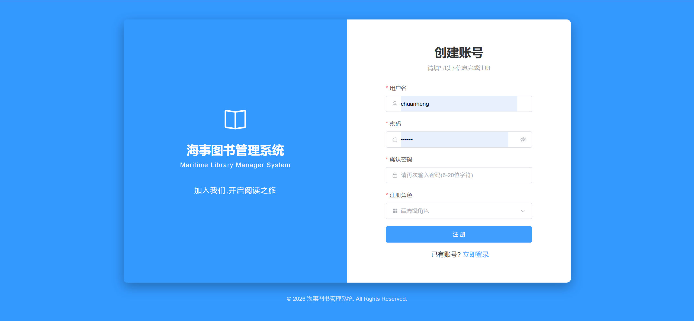

## Vue3+SpringBoot3图书管理页面

#### 主要技术栈

- vue3、vuex、VueRouter4、element plus、axios、sass
- SpringBoot3、JDK8、MySQL、Mybatis Plus

#### 主要功能展示

- 实现读者证相关功能
  
- 实现借阅图书功能
  
- 实现图书查询功能
  
- 用户注册登录功能
  

#### 如何启动项目

1. 引入依赖
   pnpm i
2. 运行预览
   pnpm dev
3. 打包项目
   pnpm dist
